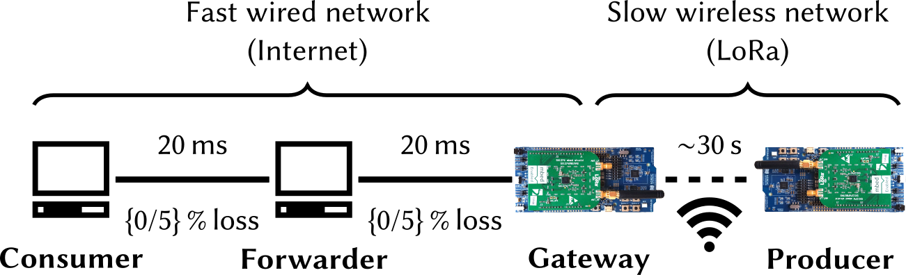

# Organization of this Folder

- [mininet](mininet/): Contains the mininet build fundamentals and a topology file.
- [RIOT](https://github.com/inetrg/RIOT/tree/pub/acmicn22): Contains the operating system which provides integration code for ccn-lite and openDSME.
- [experiments](experiments/): Contains automation scripts to compile, flash, and execute experiments.
- [external_modules](external_modules/): Contains code extensions for our protocol extensions and analyses. They mostly relate to ccn-lite.
- [ccn-lite-extensions](ccn-lite-extensions/): Contains the application firmware for the LoRa node.
- [ccn-lite-gateway](ccn-lite-gateway/): Contains the application firmware for the LoRa gateway. It links to ccn-lite-extensions but compiles differently.
- [openDSME](https://github.com/inetrg/openDSME/tree/pub/acmicn22): Contains the IEEE 802.15.4 DSME MAC implementation.
- [ccn-lite](https://github.com/inetrg/ccn-lite/tree/pub/acmicn22): Contains the ICN stack.


# Prerequisites

## Getting the Code

Clone this repository and navigate to the root directory. Note, you need to set up your GitHub properly in order to clone vis SSH.

```
git clone git@github.com:inetrg/ACM-ICN-LoRa-ICN-2022.git && cd ACM-ICN-LoRa-ICN-2022
```

Update all git submodules:
```
git submodule update --init --recursive
```

## Installing Docker

Most tools are available in docker, hence, [docker](https://docker-docs.netlify.app/install/) needs to be installed on your system.


## Compiling RIOT Applications
In order to cross-compile applications for RIOT, a set of standard tools needs to be present on your machine. We recommend a Linux based environment when compiling RIOT. For further information about the build environment, we refer to the [RIOT Getting Started Guide](https://doc.riot-os.org/getting-started.html). The most convenient alternative among the options is the [Use Docker to build RIOT](https://doc.riot-os.org/getting-started.html#docker) option.

## Flashing Embedded Devices
To flash, [SEGGER JLink](https://www.segger.com/jlink-software.html) is
required.

## Running RIOT Native Instances on Mininet

### Requirements
Install openvswitch:

```
sudo apt-get install openvswitch-switch
```

Make sure `openvswitch` kernel module is loaded

```
sudo modprobe openvswitch 
```

### Install from Docker

Navigate to [mininet](mininet/) and execute
```
docker build -t inetrg/mininet .
```


# Experiment Execution


## Measurement Setup


- 2 x nRF52840dk
- 2 x SX1276MB1MAS
- 2 x micro USB cable

Plug the two boards into your computer.

**Note:** Though untested, other microcontroller boards and LoRa radio breakout boards should work too. Compilation for other boards requires to export the `BOARDS` variable accordingly. Varying the external hardware typically requires re-wiring and re-configuration of the pin parameters ([compare this](https://github.com/RIOT-OS/RIOT/blob/master/drivers/sx126x/include/sx126x_params.h#L92)).

## Compile and Flash

Navigate to the [experiments](experiments/) folder and execute this to compile all firmware variants and flash devices:

```
./compile_and_flash.sh
```

## Start Mininet

Navigate to the [mininet](mininet/) folder and run the emulation with:

```
make
```

If you want to enable link loss, change [this line](mininet/topology.py:58) beforehand.


# Experiment Execution

## Automated execution (recommended)

Navigate to the [experiments](experiments/) folder and run the script:

```
./ccn_exp_template.sh <exp> <num>
```

`num` is the number of contents in an experiment run. With an average content interval of 60 seconds, 60 iterations already require one hour.

`exp` is one out of 8 configurations. Compare Table 2 in our paper:

1. `vanillaa1`: **Vanilla (1)**; INR
3. `vanillaa2`: **Vanilla (1)**; CR
2. `vanillab1`: **Vanilla (2)**; INR
4. `vanillab2`: **Vanilla (2)**; CR
5. `vanillac1`: **Vanilla (3)**; INR
6. `vanillac2`: **Vanilla (3)**; CR
7. `cust`: **Delay-tolerant retrieval**
8. `push`: **Reflexive-push**


You can pipe the outputs to process the experiment results.

## Manual Execution (not recommended)

If you want to execute steps manually, using the node shell, find more information in this [README](ccn-lite-extensions/README.md) .

## Troubleshooting
- There is an initial (static) wait time of 70 seconds to let the node join the DSME network. This is generally sufficient, however, in few occasions a node might not have joined within that time. The green LED of the LoRa node will indicate that it is synchronized.
- The automation script (`ccn_exp_template.sh`) parses serial output of the IoT nodes. On some machines we found that the initial parsing of MAC addresses does not always work on the first try. The script will abort automatically and let you know. In this case, reset the boards using the reset button and try again.
